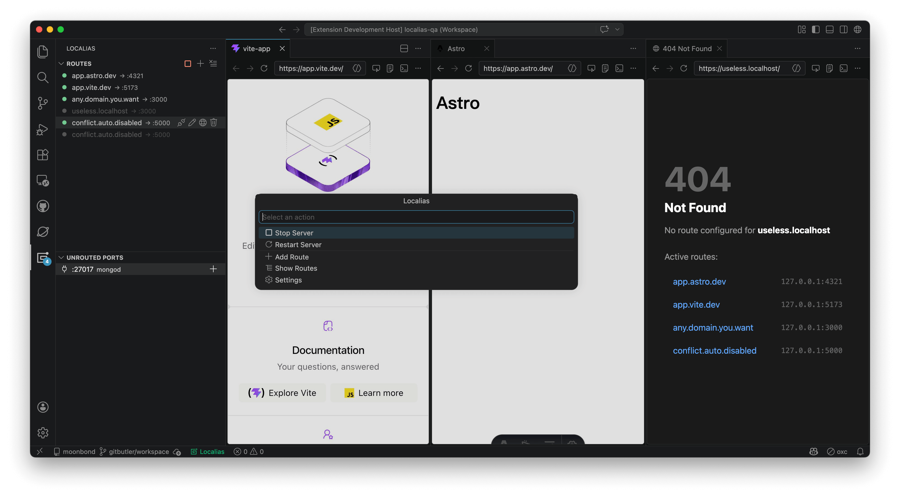

<h1 align="center">Localias</h1>

<!-- <p align="center">
  <a href="https://marketplace.visualstudio.com/items?itemName=Vizards.localias"></a>
  <a href="https://open-vsx.org/extension/Vizards/localias"></a>
</p> -->
<!-- 
<p align="center">
  <a href="https://marketplace.visualstudio.com/items?itemName=Vizards.localias"></a>
  <a href="https://marketplace.visualstudio.com/items?itemName=Vizards.localias"></a>
  <a href="https://marketplace.visualstudio.com/items?itemName=Vizards.localias"></a>
</p> -->

<p align="center">
  <a href="https://open-vsx.org/extension/Vizards/localias"></a>
  <a href="https://open-vsx.org/extension/Vizards/localias"></a>
  <a href="https://open-vsx.org/extension/Vizards/localias"></a>
</p>

**Use `https://any.domain.you.want` for your local dev servers — right inside VS Code.**

Tired of juggling `localhost:3000`, `localhost:5173`, `localhost:8080`? Localias lets you access your local dev servers via **any domain you want** with:
- Trusted certificates
- No browser warnings
- Zero manual setup



## Why Localias?

- **OAuth & Cookies** won't work on `localhost:port` — custom domains fix that
- **Multiple projects** running at once? Give each one a memorable name instead of port numbers
- **Share-nothing HTTPS** — every domain gets a trusted certificate via [mkcert](https://github.com/FiloSottile/mkcert), no more "Your connection is not private"
- **Manage everything from VS Code** — no config files, no CLI, no terminal

## Features

### Domain → Port Routing
Map `dev.example.org → :5173`, `site-01.local → :3000`, `hack.visualstudio.com → :8080` — any domain, any port. **Wildcard routes** (`*.example.com`) are also supported for matching all subdomains. Add routes from the sidebar or Command Palette — they take effect immediately.

### Automatic HTTPS Certificates
Certificates are generated on-the-fly via [mkcert](https://github.com/FiloSottile/mkcert). Per-domain SNI means each domain gets its own cert. Certs auto-renew before expiry.

### Hosts File Auto-Management
Domains are automatically added to the hosts file when you create a route and cleaned up when you remove it. Choose between sudo-prompt (secure, per-write auth) or chmod mode (one-time auth, no further prompts). Wildcard routes (`*.example.com`) and `.localhost` domains are skipped — they can't go in `/etc/hosts` or don't need to.

### Smart Port Detection
The sidebar shows all listening ports on your machine. Unrouted ports appear in the **Unrouted Ports** panel — click to instantly create a route. Routes auto-disable when the target port goes offline and re-enable when it comes back.

### HTTP/2 & WebSocket Support
Full HTTP/2 with automatic HTTP/1.1 fallback. WebSocket connections are transparently proxied — HMR (Vite, webpack) works out of the box.

### Developer-Friendly Error Pages
When a target server is down, Localias shows a styled 502 page instead of a cryptic browser error. Loop detection catches misconfigured proxy chains.

### Integrated Terminal CA Trust
`NODE_EXTRA_CA_CERTS` is automatically injected into VS Code's integrated terminal, so `node`, `curl`, and other tools trust the mkcert CA without extra configuration.

### HTTP → HTTPS Redirect
Plain HTTP requests are automatically redirected to HTTPS. A best-effort port 80 listener handles `http://domain/` → `https://domain/` redirects.

## Getting Started

### Prerequisites

Install [mkcert](https://github.com/FiloSottile/mkcert) (Localias will guide you if it's missing):

```sh
brew install mkcert    # macOS
mkcert -install        # trust the CA
```

### Usage

1. Open the **Localias** sidebar in the Activity Bar
2. Click **+** to add a route — type any domain you like (e.g. `app.local`), pick a port
3. Click **▶ Start** — that's it, open `https://app.local` in your browser

## Settings

| Setting | Default | Description |
|---|---|---|
| `localias.routes` | `[]` | Domain → port routing rules |
| `localias.listenPort` | `443` | Port the HTTPS proxy listens on |
| `localias.autoStart` | `false` | Start the proxy automatically when VS Code opens |
| `localias.certDir` | `~/.localias/certs` | Certificate storage directory |
| `localias.mkcertPath` | `mkcert` | Path to mkcert binary |
| `localias.manageHosts` | `true` | Automatically manage hosts file entries |
| `localias.hostsWriteMode` | `sudo-prompt` | How to write to hosts file (`sudo-prompt` or `chmod`) |
| `localias.tlds` | `["localhost"]` | TLD candidates shown when typing a bare domain name |
| `localias.loopbackDomains` | `[]` | Domain suffixes that already resolve to `127.0.0.1` (e.g. `localtest.me`) — skips hosts file management |
| `localias.portBlacklist` | *(common apps)* | Process names hidden from the Unrouted Ports panel |

## Port 443 on macOS

macOS Mojave+ allows non-root processes to bind to privileged ports on all interfaces. Localias listens on `0.0.0.0:443` by default — **no sudo needed**.

If you still get permission errors, set `localias.listenPort` to a higher port like `8443`.

## Proxy Tool Compatibility

If you use a proxy tool with **Fake IP / Enhanced Mode** (Surge, ClashX, etc.), it may intercept DNS for your route domains. This can cause `localhost` to resolve to a fake IP instead of `127.0.0.1`, breaking Vite and other dev servers.

**Workarounds:**
- Add `localhost` to your proxy's `always-real-ip` list
- Set `server.host: '127.0.0.1'` in your dev server config to bypass DNS
- For domains managed via `loopbackDomains`, add them to the proxy's bypass list

Localias's proxy itself is immune — it uses a hardcoded loopback connection that bypasses system DNS entirely.

## Acknowledgements

Inspired by [vercel-labs/portless](https://github.com/vercel-labs/portless).

## License

[MIT](LICENSE)
